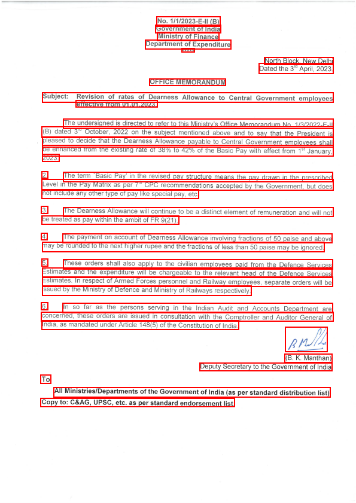
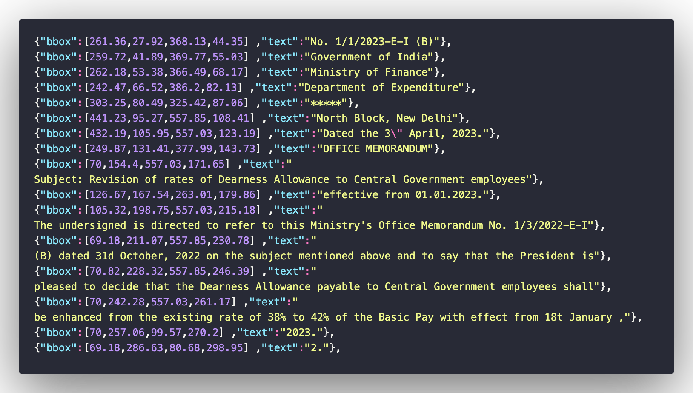
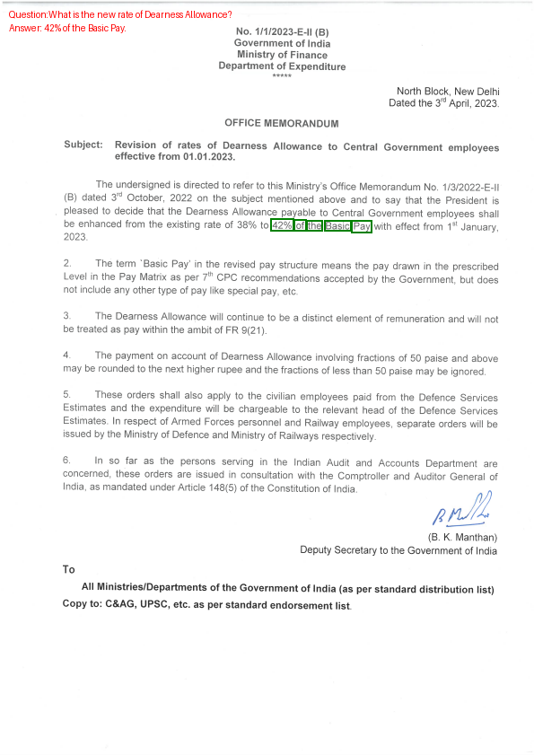
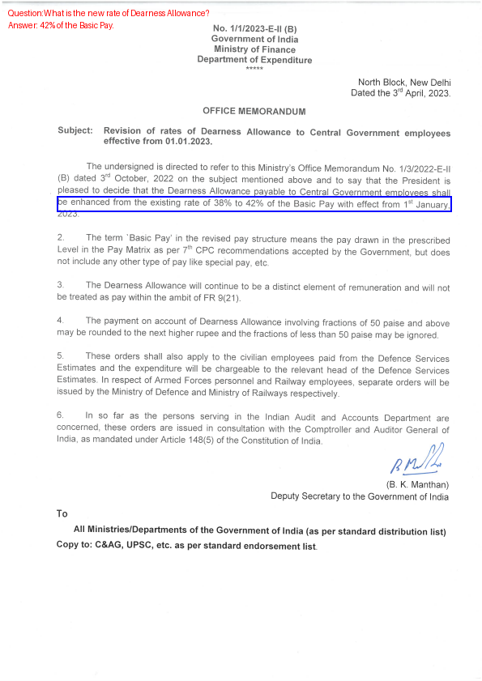
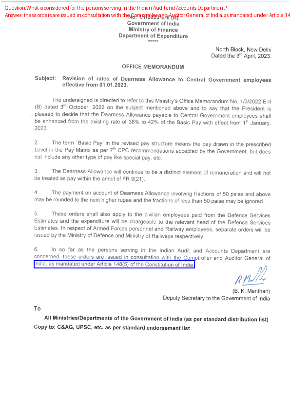
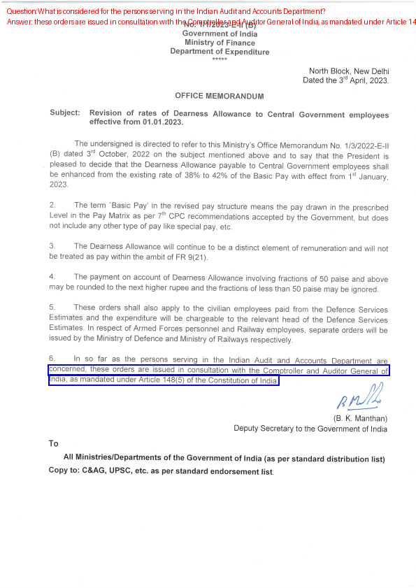

# DrishtiKon Grounding Demo

A Streamlit-based web application for visual grounding and document understanding. This application allows users to upload images or PDFs and ask questions about their content, with the system providing answers along with visual grounding at different levels (block, line, word, and point).

## Application

Directory : ```DhrishtiKon/application```

## GR_VQA-Grounding

Research on Grounding for the QnA pairs in Government Regulatory Documents


## Engineering Solution for Grounding - OCR + Text Matching

1. OCR the Image to get the text regions
2. Match the Question and Answer with the text regions using Text Matching strategy
3. Return the Grounding(bbox, text) for the Question and Answer 

## Text Matching Strategy


This module implements a robust strategy to match a **question-answer pair** against **OCR-predicted text regions** in an image. The goal is to determine the most semantically and structurally relevant text regions (bounding boxes) that correspond to the provided answer, optionally influenced by the question context.

### 🔎 Function: `get_matched_regions(question_text, target_text, predictions)`

#### Purpose:
To evaluate and score each OCR-detected region based on its similarity to the target answer (and optionally, question context), and return the **top matched regions**.

#### Matching Strategy:

The final `combined_score` for each region is derived using the following weighted approach:


---

### ⚙️ Matching Parameters and Weights

| Parameter               | Description                                                                 | Value (Default) |
|-------------------------|-----------------------------------------------------------------------------|------------------|
| **Answer Score**        | Combines fuzzy token set matching, partial ratio, and length adjustment.   | 0.8              |
| **Question Score**      | Uses individual token-based fuzzy matching against the region text.         | 0.2              |
| **CUT_OFF_THRESHOLD**   | Minimum score required for a region to be considered a valid match.         | `70`             |
| **MAX_MATCHES**         | Maximum number of top-scoring regions to return per query.                 | `5`              |

> Adjust these values depending on how strict or lenient you want the text grounding to be. A higher `CUT_OFF_THRESHOLD` increases precision; a higher `MAX_MATCHES` increases recall.


#### Score Components:

1. **Exact Match Check**:  
   If the target answer text exists exactly within the region text, it is assigned a perfect score (`match_score = 100`), and processing for that region is short-circuited.

2. **Partial & Token-Based Fuzzy Matching**:  
   Uses [FuzzyWuzzy](https://github.com/seatgeek/fuzzywuzzy) metrics:
   - `fuzz.partial_ratio`
   - `fuzz.token_set_ratio`

3. **Length Normalization**:
   - Longer region texts (relative to answer length) are favored.
   - Very short region texts are penalized unless they are exact matches.

4. **Question Context Matching**:
   - Each term in the question is compared against the region text.
   - Best fuzzy match scores are used to compute the overall question relevance.

5. **Threshold Filtering**:
   - Regions with a final combined score below the defined `CUT_OFF_THRESHOLD` are ignored.

6. **Sorting and Top-K Selection**:
   - Matched regions are sorted in descending order of `match_score`.
   - Only the top `MAX_MATCHES` are returned.

---

## 🔤 Function: `get_word_level_matches(answer_text, top_k_matches)`

#### Purpose:
To extract fine-grained word-level bounding boxes from top-matched regions that correspond to the answer text.

#### Logic:
- Iterates through each region’s `words` (word-level OCR output).
- Identifies word indices that are present in the answer.
- Selects the **longest sequence of consecutive matching words** to ensure contextual coherence.
- Returns their corresponding bounding boxes.

> ⚠️ Depends on each region having a `words` list with structure:
```json
{
  "text": "word",
  "bbox": [x1, y1, x2, y2]
}
```

---

## 🔁 Supporting Function: `longest_consecutive_range(indices)`

Utility to compute the **longest contiguous subsequence** of word indices — ensuring that matched phrases are continuous in the layout rather than scattered.

---


## OCR Model

Currently using Doctr OCR model


<div style="display: flex; justify-content: space-around;">

  <div style="text-align: center;">
    
    <p>DocTR Detection</p>
  </div>

  <div style="text-align: center;">
    
    <p>DocTR Recognition</p>
  </div>
</div>

---

### Word -level and Line -level Grounding Support

<div style="display: flex; justify-content: space-around;">

  <div style="text-align: center;">
    
    <p>Word-level Grounding</p>
  </div>

  <div style="text-align: center;">
    
    <p>Line-level Grounding</p>
  </div>
</div>

---

### Multi-line Grounding Support

Top k matches from the Text-matching strategies as grounding could contain multiple lines of text.

<div style="display: flex; justify-content: space-around;">

  <div style="text-align: center;">
    
    <p>Multi-Line Grounding Problem</p>
  </div>

  <div style="text-align: center;">
    
    <p>Multi-Line Grounding Solution</p>
  </div>
</div>


### Tradeoff between Multi-Line Grounding and Grounding Accuracy

Since adding multi-line support for the engineering solution might reduce the accuracy of the Grounding

**TODO** to handle this


# Annotation Tool

For annotating the images with bounding boxes at block, line, word and point levels for visual question-answering tasks.

Folder path : `annotation`

Instructions path : `annotation/README.md`